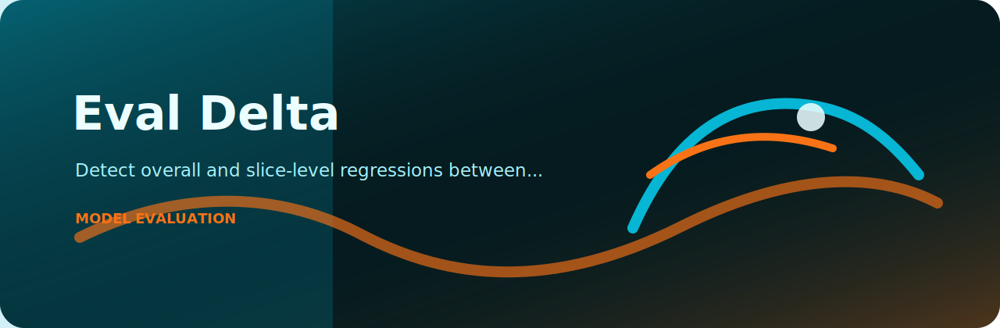
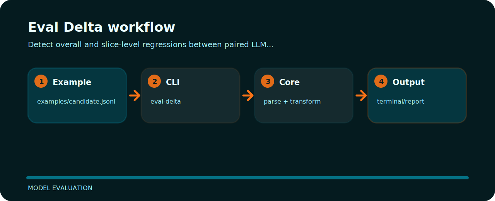

# Eval Delta



Eval Delta focuses on one practical job in model evaluation. The README below is arranged around the shortest path from clone to result.

## First run

```bash
git clone https://github.com/mertefekurt/eval-delta.git
cd eval-delta
python -m pip install -e ".[dev]"
eval-delta examples/candidate.jsonl
```

## File map

```text
.github/        CI workflow
examples/       sample inputs
src/            package source
tests/          test coverage
.gitignore      project file
pyproject.toml  package metadata
```

## Processing path


