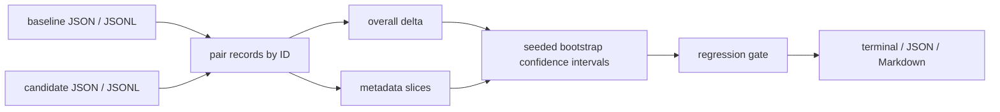

# eval-delta

[](https://github.com/mertefekurt/eval-delta/actions/workflows/ci.yml)
[](https://www.python.org/)
[](LICENSE)

**Catch the cohort that an average score hides.**

`eval-delta` compares two paired LLM evaluation runs and identifies regressions overall and inside
metadata slices such as language, task, customer tier, or prompt version. It is a local,
dependency-free quality gate for model, prompt, and retrieval changes.

```text
eval-delta · 8 paired records
regression threshold: 0.050 · confidence: 95%

STATUS   SLICE                 N  BASE   CAND   DELTA   95% CI            W/T/L
PASS     overall               8  0.744  0.733  -0.011  [-0.149, +0.128]  4/0/4
PASS     metadata.language=en  4  0.675  0.850  +0.175  [+0.170, +0.180]  4/0/0
REGRESS  metadata.language=tr  4  0.812  0.615  -0.198  [-0.205, -0.190]  0/0/4

1 regression found
```

The aggregate result is nearly flat. The Turkish slice is not.

## Why it is useful

Evaluation pipelines often report one mean score. That number can improve while a critical
language, task, or customer cohort gets worse. `eval-delta` makes those changes visible and gives
CI a stable exit code without calling another model or uploading evaluation data.

Key features:

- pairs baseline and candidate records by ID instead of comparing unrelated averages
- calculates mean score deltas, win/tie/loss counts, and seeded bootstrap confidence intervals
- analyzes any repeated metadata field, including nested paths such as `metadata.language`
- emits terminal, JSON, or Markdown reports for local work, automation, and pull requests
- separates regressions from malformed input through explicit exit codes
- runs entirely on the Python standard library

## Install

Python 3.11 or newer is required.

```bash
git clone https://github.com/mertefekurt/eval-delta.git
cd eval-delta
python -m venv .venv
source .venv/bin/activate
python -m pip install -e .
```

For development:

```bash
python -m pip install -e ".[dev]"
```

## Compare two runs

Each input can be JSONL, a JSON array, a single JSON object, or an object containing `records`.
Records need a stable ID and a numeric score:

```json
{"id":"refund-17","score":0.82,"metadata":{"language":"en","task":"policy_qa"}}
```

Run the included comparison:

```bash
eval-delta examples/baseline.jsonl examples/candidate.jsonl \
  --slice-field metadata.language \
  --min-slice-size 3 \
  --max-regression 0.05
```

Use nested fields or produce a pull-request-friendly report:

```bash
eval-delta baseline.jsonl candidate.jsonl \
  --id-field sample.id \
  --score-field metrics.groundedness \
  --slice-field metadata.language \
  --slice-field metadata.task \
  --format markdown \
  --output reports/eval-delta.md
```

Machine-readable output is suitable for downstream dashboards:

```bash
eval-delta baseline.jsonl candidate.jsonl --format json
```

### CLI options

| Option | Purpose |
| --- | --- |
| `--id-field PATH` | Record ID path; defaults to `id` |
| `--score-field PATH` | Numeric score path; defaults to `score` |
| `--slice-field PATH` | Candidate metadata field to analyze; repeatable |
| `--min-slice-size N` | Ignore slices smaller than `N`; defaults to `3` |
| `--max-regression FLOAT` | Largest tolerated mean score drop; defaults to `0.02` |
| `--confidence FLOAT` | Bootstrap confidence level; defaults to `0.95` |
| `--bootstrap-samples N` | Seeded bootstrap resamples; defaults to `2000` |
| `--seed N` | Reproducibility seed; defaults to `17` |
| `--require-complete-pairs` | Reject records present in only one run |
| `--format terminal\|json\|markdown` | Select the report format |
| `--output PATH` | Write the report to a file |

Exit code `0` means no credible regression was found, `1` means at least one regression crossed the
configured threshold, and `2` means the input or configuration is invalid. A regression must have
both a mean drop beyond the threshold and a confidence interval entirely below zero.

## Workflow



Slice values are read from the candidate run so newly introduced metadata can be evaluated without
rewriting the baseline. Unmatched IDs are reported and can be promoted to an input error with
`--require-complete-pairs`.

## Tests

```bash
ruff check .
ruff format --check .
pytest
python -m eval_delta --help
```

The test suite covers nested-field loading, malformed and duplicate records, pairing, deterministic
confidence intervals, hidden slice regressions, minimum slice sizes, all report formats, and CLI
exit behavior.

## License

MIT
